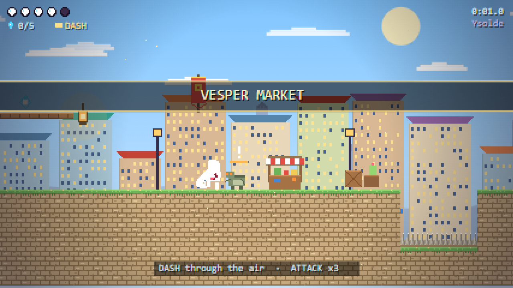
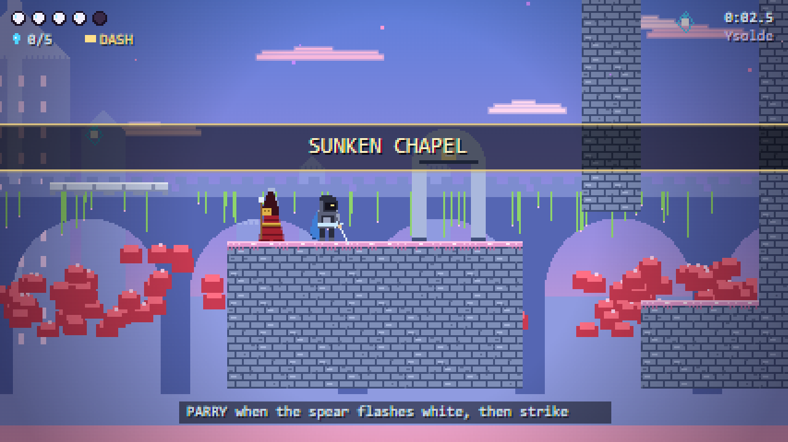
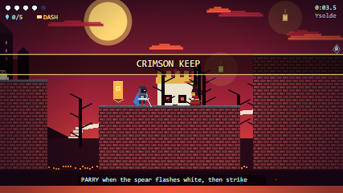

# Gloomfall: The Pilgrim's Road

A dark, colourful 2D Metroidvania vertical slice: **Hollow Knight** movement (variable jump, coyote time, jump buffer, dash i-frames, wall slide & wall jump) meets **Blasphemous** combat (3-hit combo with lunge, directional slashes, a real parry with hitstop, knockback and an execution window).

Pure web platform. No build step, no runtime dependencies, no network calls after first load. Installable PWA, fully offline, saves your pilgrim's name, character and progress on the device.

> Live: `https://<your-user>.github.io/<repo>/` after the first push to `main` (see **Deploy**).





## Play

| Action | Keyboard | Gamepad | Touch |
|---|---|---|---|
| Move | ← → / A D | Left stick / D-pad | Left pad |
| Jump (hold = higher) | Space / Z / K | A | **J** |
| Attack (↑ / ↓ in air = directional) | X / J | X | **A** |
| Dash | C / L / Shift | B / RB | **D** |
| Parry | V / I | Y / LB | **P** |
| Pause | Esc / P / Enter | Start | ⏸ button |

- Push into a wall while falling to slide; press jump to kick off diagonally and climb.
- A down-slash that connects (enemy or spikes) pogos you upward.
- When a Zealot's spear **flashes white**, press parry. On success time freezes, the enemy staggers, and your next swing is a lunging **riposte** that executes.
- Mistime the parry and you are exposed for the full recovery.

## Run locally

```bash
npm start          # node tools/dev-server.mjs 8080  (any static server works)
```

Open <http://127.0.0.1:8080/>. Add `?nosw` during development to bypass the service worker.

```bash
npm test           # unit tests (node --test), no install needed
npm run check      # tests + service-worker precache audit
npm run icons      # regenerate icons from tools/gen-icons.py (needs Pillow)
npm run lighthouse # Lighthouse CI, mobile throttling (needs network for npx)
npm run e2e        # Playwright smoke tests (needs network for npx)
```

## Deploy (GitHub Pages → median.co)

1. Push to a GitHub repository. In **Settings → Pages** choose **GitHub Actions** as the source.
2. `.github/workflows/deploy.yml` runs tests, stamps the service-worker version with the commit SHA, and publishes the site. Every push to `main` deploys.
3. Give median.co the Pages URL. The manifest, icons, auto-rotation and full offline cache are already in place, so the wrapped Android/iOS app works with the same code. Enable "Offline mode" in median if you want the wrapper's own cache on top; the service worker already covers it.

Everything uses relative paths (`./`), so the site works from a sub-path such as `/repo-name/`.

## Project layout

```
index.html            app shell (strict CSP, manifest, a11y screens, touch controls)
manifest.json         Web App Manifest (icons any/maskable/monochrome, screenshots, shortcuts)
sw.js                 service worker: precache app shell, cache-first + SWR, offline fallback
offline.html          shown only if the shell was never cached
css/app.css           mobile-first shell styles, safe areas, reduced-motion
js/
  main.js             boot, DOM screens, SW registration, install prompt
  game.js             fixed-step loop, hitstop, world events, respawn, save
  combat.js           hit resolution: attacks, parry window, contact damage
  core/               constants (all tuning), fsm, input, camera, audio, storage, util
  world/              level grid + collision (level.js), authored level (world1.js)
  entities/           entity base, Player FSM, Enemy FSM (Husk, Zealot)
  render/             procedural sprites & tiles, parallax backdrops, renderer, HUD
  fx/particles.js     particles, floating text, dash ghosts
tests/                node --test unit tests + Playwright e2e
tools/                icon generator, precache audit
docs/                 ARCHITECTURE.md, TESTING.md
legacy/               the original Streamlit prototype (not part of the build)
```

See [docs/ARCHITECTURE.md](docs/ARCHITECTURE.md) for the design (state machines, physics, PWA strategy, security, accessibility) and [docs/TESTING.md](docs/TESTING.md) for the test pyramid.

## License

MIT.
